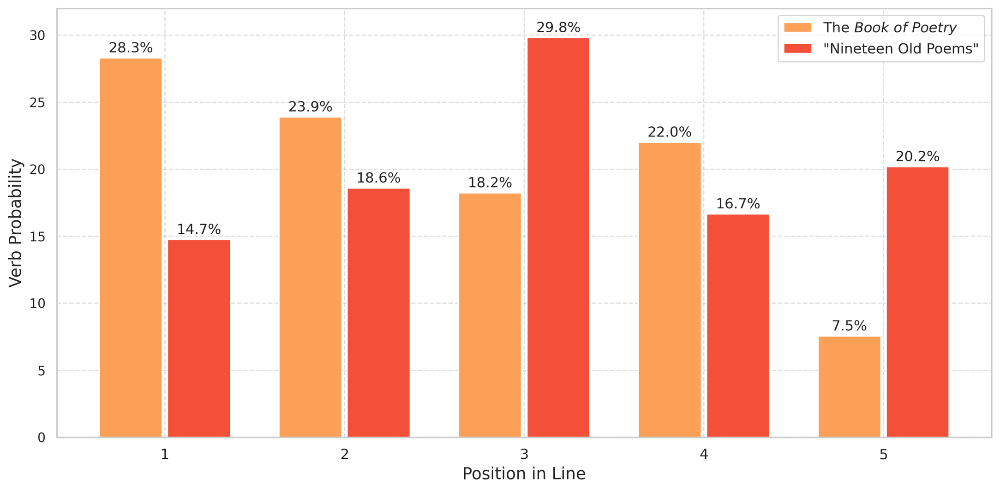

# Brevity and Breadth

## A Linguistic, Aesthetic, and DH-Assisted Study of the *Book of Poetry* and "Nineteen Old Poems"

Integrating traditional Chinese poetics, modern linguistics, and computational analysis, this article explores how the pre-Qin *Book of Poetry* (*Shijing* 詩經) and the Han “Nineteen Old Poems” (*Gushi shijiu shou* 古詩十九首) realized the linguistic-aesthetic ideal “brevity in form and breadth in meaning” (*wenyue yiguang* 文約意廣), as articulated by Zhong Rong 鍾嶸 (ca. 468–518) in his evaluation of tetrasyllabic and pentasyllabic verses in classical Chinese poetry. The authors fine-tune a language model (SikuBERT) to detect verbs in poetic lines and show how the tetrasyllabic *Book of Poetry* employs topic-comment sentences, in combination with simple subject-predicate syntax (one verb in a line), to convey rich content and vivid emotions with minimal word usage. By contrast, the pentasyllabic “Nineteen Old Poems” leverages a flexible line-by-line variation of complex subject-predicate syntax (two verbs) as well as lexically concrete binomes and three-character noun phrases, establishing an alternative route of lyricism characterized by sustained observation and reflection. The statistical analysis of verb distribution in “Nineteen Old Poems” also demonstrates a persistent preference for verb placement toward the last three characters of the pentasyllabic line (*touqing weizhong* 頭輕尾重), leading to the formation of a new 2+(1+2/2+1) rhythm unknown to pre-Qin poetry. Through language modeling and traditional literary analysis, the article yields new insights into how Han pentasyllabic poets reinvented vocabulary, syntax, rhythms, and structure and thereby scaled new heights of “brevity in form and breadth in meaning.”

[Cai, Zong-qi, and Maciej Kurzynski. "Brevity and Breadth: A Linguistic, Aesthetic, and DH-Assisted Study of the *Book of Poetry* and 'Nineteen Old Poems,'", *Journal of Chinese Literature and Culture* (*JCLC*), 2024(2), 235–264.](https://read.dukeupress.edu/jclc/article-abstract/11/2/235/397123/Brevity-and-Breadth-A-Linguistic-Aesthetic-and-DH?redirectedFrom=fulltext)