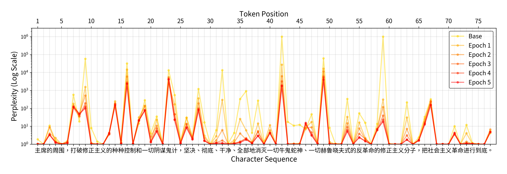

# Cognitive Stylometry

Language models predict the next word by learning statistical patterns from their training data. This project uses perplexity (a measure of prediction difficulty) to study style as a tension between expectation and surprise. By comparing how predictable different texts are to models fine-tuned on specific corpora, we can expose the mechanisms through which different forms of discourse constrain or liberate imagination.

## Publications

### Cognitive Stylometry: A Computational Study of Defamiliarization in Modern Chinese

Autoregressive language models generate text by predicting the next word from the preceding context. The regularities internalized from specific training data make this mechanism a useful proxy for historically situated readerly expectations, reflecting what earlier linguistic communities would find probable or meaningful. In this article, I pre-train a GPT model (223M parameters) on a broad corpus of Chinese texts (*FineWeb Edu V2.1*) and fine‑tune it on the collected writings of Mao Zedong (1893–1976) to simulate the evolving linguistic landscape of post‑1949 China. Identifying token sequences with the sharpest drops in perplexity—a measure of the model's surprise—allows me to identify the core phraseology of "Maospeak," the militant language style that developed from Mao's writings and pronouncements. A comparative analysis of modern Chinese fiction reveals how literature becomes unfamiliar to the fine-tuned model, generating perplexity spikes of increasing magnitude. The findings suggest a mechanism of attentional control: whereas propaganda backgrounds meaning through repetition (cognitive overfitting), literature foregrounds it through deviation (non-anomalous surprise). By visualizing token sequences as perplexity landscapes with peaks and valleys, the article reconceives style as a probabilistic phenomenon and showcases the potential of "cognitive stylometry" for literary theory and close reading.

Kurzynski, Maciej, ["Cognitive Stylometry: A Computational Study of Defamiliarization in Modern Chinese,"](https://www.cambridge.org/core/journals/computational-humanities-research/article/cognitive-stylometry-a-computational-study-of-defamiliarization-in-modern-chinese/806CD4721AEC85C07473396825C3D7DD) *Computational Humanities Research*, 5 December 2025, pp. 1-17.

---

### Perplexity Games: Maoism vs. Literature through the Lens of Cognitive Stylometry

The arrival of large language models (LLMs) has provoked an urgent search for stylistic markers that could differentiate machine text from human text, but while the human-like appearance of machine text has captivated public attention, the reverse phenomenon—human text becoming machine-like—has raised much less concern. This conceptual lag is surprising given the ample historical evidence of state-backed attempts to regulate human thought. The present article proposes a new comparative framework, Perplexity Games, to leverage the predictive power of LLMs and compare the statistical properties of Maospeak, a language style that emerged during the Mao Zedong's era in China (1949-1976), with the style of canonical modern Chinese writers, such as Eileen Chang (1920-1995) and Mo Yan (1955-). The low perplexity of Maospeak, as computed across different GPT models, suggests that the impact of ideologies on language can be compared to likelihood-maximization text-generation techniques which reduce the scope of valid sequence continuations. These findings have cognitive implications: whereas engineered languages such as Maospeak hijack the predictive mechanisms of human cognition by narrowing the space of linguistic possibilities, literature resists such cognitive constraints by dispersing the probability mass over multiple, equally valid paths. Exposure to diverse language data counters the influences of ideologies on our linguistically mediated perceptions of the world and increases the perplexity of our imaginations.

Kurzynski, Maciej, ["Perplexity Games: Maoism vs. Literature through the Lens of Cognitive Stylometry,"](https://jdmdh.episciences.org/13429) *Journal of Data Mining and Digital Humanities*, NLP4DH, 29 April 2024.