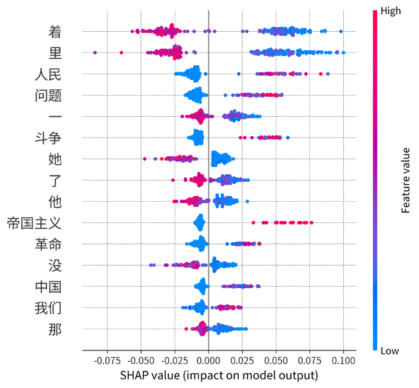

# About

# Publications

## Perplexity Games: Maoism vs. Literature through the Lens of Cognitive Stylometry

The arrival of large language models (LLMs) has provoked an urgent search for stylistic markers that could differentiate machine text from human text, but while the human-like appearance of machine text has captivated public attention, the reverse phenomenon—human text becoming machine-like—has raised much less concern. This conceptual lag is surprising given the ample historical evidence of state-backed attempts to regulate human thought. The present article proposes a new comparative framework, Perplexity Games, to leverage the predictive power of LLMs and compare the statistical properties of Maospeak, a language style that emerged during the Mao Zedong's era in China (1949-1976), with the style of canonical modern Chinese writers, such as Eileen Chang (1920-1995) and Mo Yan (1955-). The low perplexity of Maospeak, as computed across different GPT models, suggests that the impact of ideologies on language can be compared to likelihood-maximization text-generation techniques which reduce the scope of valid sequence continuations. These findings have cognitive implications: whereas engineered languages such as Maospeak hijack the predictive mechanisms of human cognition by narrowing the space of linguistic possibilities, literature resists such cognitive constraints by dispersing the probability mass over multiple, equally valid paths. Exposure to diverse language data counters the influences of ideologies on our linguistically mediated perceptions of the world and increases the perplexity of our imaginations.

[Kurzynski, Maciej. "Perplexity Games: Maoism vs. Literature through the Lens of Cognitive Stylometry," *Journal of Data Mining and Digital Humanities*, NLP4DH, 29 April 2024.](https://jdmdh.episciences.org/13429)