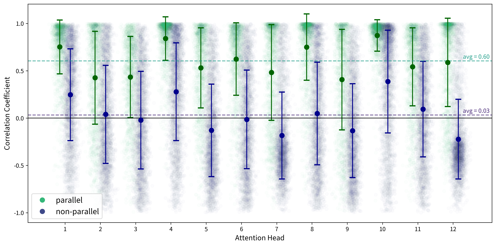

# Parallelism and Geometry

Poetic phenomena have geometric substrates. This underlying geometry is detectable and measurable as patterns of alignment within a multidimensional semantic space, much as symbolic-metric relationships are measurable on textual surfaces. Poetic artistry can be thus understood as the discovery and articulation of latent symmetries within our conceptual world.

## Publications

### From Character to Poem: Nested Contexts and Scalar Limits of Parallelism in Classical Chinese Poetry

Benchmarking for literary analysis is complicated by a persistent mismatch between the fixed context windows of classification models and the emergent properties of literary forms. Here, I approach this challenge through the lens of information theory, treating aesthetic features as signals encoded at specific scales. Using semantic parallelism in Chinese regulated verse (*lüshi* 律詩) as a case study, I first employ a "teacher" model to encode parallelism at the couplet (meso) level and then test which "student" model architecture—micro (character), meso (couplet), or macro (poem)—can most effectively decode this signal. The experiment points to a "Goldilocks hypothesis": performance is maximized when the classifier is structurally aligned with the scale at which the feature has been encoded. Furthermore, the results yield a tripartite theoretical insight: (1) bottom-up aggregation of local predictions sacrifices raw performance but offers greater interpretability by exposing the specific decisions of a misaligned model; (2) top-down inference requires additional training computation to compensate for global noise and achieve performance comparable to aligned models; (3) if the goal is to explain how artificial intelligence represents complex literary phenomena internally ("vector poetics"), aligned classifiers afford the most direct and promising access. As such, the study invites discussion on whether meaningful benchmarking requires matching the computational "unit of analysis" with the humanistic "unit of inquiry."

Kurzynski, Maciej, "[From Character to Poem: Nested Contexts and Scalar Limits of Parallelism in Classical Chinese Poetry](#)," *Journal of Open Humanities Data*, forthcoming.

### The Game of Keys and Queries: Parallelism and Cognitive Geometry in Chinese Regulated Verse

Language models represent word meanings as vectors in a multidimensional space. Building on this property, this study offers a geometric perspective on parallelism in classical Chinese poetry, complementing traditional symbolic interpretations. To automatically detect parallelism in poetic verse, the authors train a BERT-based classifier on a dataset of over 140,000 regulated poems (*lüshi* 律詩), achieving performance on par with state-of-the-art generative models such as GPT-4.1 and DeepSeek R1. Unlike general-purpose models, the custom classifier offers unique insights into how poetic meaning is encoded geometrically. The analysis shows that parallel lines exhibit alignment in the model’s attention patterns: the ‘key’ vectors of corresponding characters point in the same direction, while this alignment disappears in non-parallel lines. This finding is interpreted through Peter Gärdenfors’s theory of cognitive semantics, which posits that humans make sense of the world by organizing experience into distinct conceptual regions. The authors argue that parallelism serves as a bridging mechanism that temporarily unites these disparate domains of meaning, suggesting a deeper, geometric order that underlies language itself.

Kurzynski, Maciej, Xiaotong Xu, and Yu Feng, "[The Game of Keys and Queries: Parallelism and Cognitive Geometry in Chinese Regulated Verse](https://www.euppublishing.com/doi/abs/10.3366/ijhac.2025.0355)," *International Journal of Humanities and Arts Computing (IJHAC)* 19, 2025(2): 143-157.

### Good Things Come in Pairs: A Computational Study of Poetic Parallelism in the Six Dynasties

This article outlines the computational methodology for a multipart study on poetic parallelism in the Six Dynasties (222–589), a formative era in the history of Chinese literature. As the first part of this project, the authors develop a quantitative-formalist definition of parallelism, synthesizing insights from modern linguistics, vector semantics, and traditional critics such as Liu Xie 劉勰 (c. 465–522) and Zhong Rong 鍾嶸 (c. 468–518), alongside key passages from Kūkai’s 空海 (774–835) *Discourse on the Secret Treasury of Literary Mirrors* (Bunkyō hifuron 文鏡秘府論). They then evaluate several statistical methods for automatic detection of parallelism in classical Chinese verse, including BERT-based classifiers and few-shot prompting of generative models such as GPT-4o and DeepSeek R1. Applying these techniques to over twenty-five thousand pentasyllabic couplets from Lu Qinli’s 逯欽立 (1910–1973) *Poetry of the Pre-Qin, Han, Wei, Jin, and Northern and Southern Dynasties* (Xian Qin Han Wei Jin Nanbeichao shi 先秦漢魏晉南北朝詩), the study traces the macroscopic evolution of parallelism across five periods: Jian’an (建安, 196–220), Zhengshi (正始, 240–249), Taikang (太康, 280–290), Yuanjia (元嘉, 424–453), and Yongming (永明, 483–493). The key finding is the demonstrable increase in the usage and sophistication of parallel structures over time, a rise in complexity that can be understood as a growing number of semantic dimensions along which poets pursued comparison. This confirms the Six Dynasties as a pivotal era for this poetic technique and validates the quantitative approach for future studies of the five individual periods and their representative poets.

Cai, Zong-qi, Maciej Kurzynski, and Xiaotong Xu, ["Good Things Come in Pairs: A Computational Study of Poetic Parallelism in the Six Dynasties"](#), *Journal of Chinese Literature and Culture* (*JCLC*), 2025(2), forthcoming.

### Vector Poetics: Parallel Couplet Detection in Classical Chinese Poetry

This paper explores computational approaches for detecting parallelism in classical Chinese poetry, a rhetorical device where two verses mirror each other in syntax, meaning, tone, and rhythm. We experiment with five classification methods: (1) verb position matching, (2) integrated semantic, syntactic, and word-segmentation analysis, (3) difference-based character embeddings, (4) structured examples (inner/outer couplets), and (5) GPT-guided classification. We use a manually annotated dataset, containing 6,125 pentasyllabic couplets, to evaluate performance. The results indicate that parallelism detection poses a significant challenge even for powerful LLMs such as GPT-4o, with the highest F1 score below 0.72. Nevertheless, each method contributes valuable insights into the art of parallelism in Chinese poetry, suggesting a new understanding of parallelism as a verbal expression of principal components in a culturally defined vector space.

Kurzynski, Maciej, Xiaotong Xu, and Yu Feng, "[Vector Poetics: Parallel Couplet Detection in Classical Chinese Poetry](https://aclanthology.org/2024.nlp4dh-1.19/)," *Proceedings of the 4th International Conference on Natural Language Processing for Digital Humanities*, Miami (USA): Association for Computational Linguistics (ACL), pp. 200-208. 

