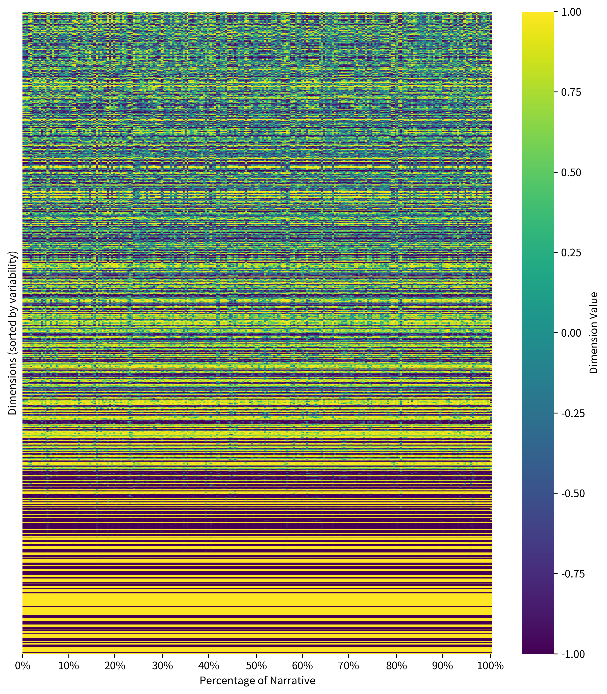

# Poly-Temporal, Multi-Layered

## A Techno-Cognitive Theory of Narrative Experience in Literature

This article draws upon recent developments in cognitive neuroscience and natural language processing to contribute a techno-cognitive perspective into the "deep reading" versus "surface reading" debate in literary studies. Research at the intersection of humanities and sciences suggests that narrative experience, including both production (decoding) and reception (encoding) of stories, constitutes a sequentially and hierarchically complex process shaped simultaneously by socio-cultural contexts, sensory-emotional dynamics, and cognitive integration across multiple levels of complexity. This interdisciplinary view contrasts with traditional humanities methodologies such as area studies, which privileges identity-based accounts of literary phenomena, or Marxist genealogy, which neglects extra-political sources of meaning. The article surveys relevant research findings across multiple domains and discusses the hermeneutic implications of the techno-cognitive approach for literary studies, exemplified in a reading of Zhang Xianliang's 1985 novel *Half of Man is Woman*.

[Kurzynski, Maciej. "Poly-Temporal, Multi-Layered: A Techno-Cognitive Theory of Narrative Experience in Literature," *International Journal of Humanities and Arts Computing* (IJHAC) 19, 2025(1), 33-48.](https://euppublishing.com/doi/full/10.3366/ijhac.2025.0343)