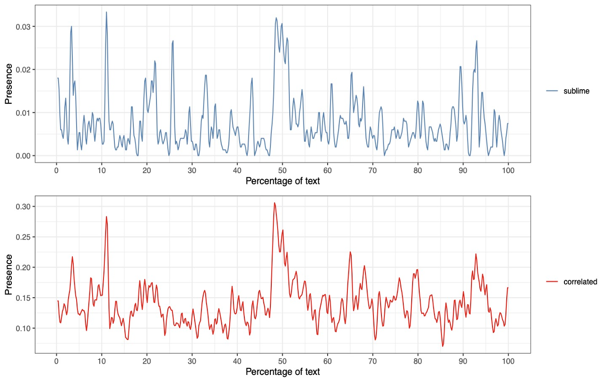

# The Sublime as a Narrative Technology

Words transmit not only semantic meaning but also affective energy. This project proposes a new, cross-cultural theory of the sublime, viewing it as a narrative "technology" and thus reversing Fredric Jameson's notion of the "technological sublime." Drawing on cognitive science and computational criticism, this project conceptualizes the sublime as a synchronized distribution of two distinct vocabularies within a text. A steady accumulation of words describing powerful natural phenomena is strategically entangled with the narrative's plot-specific terms to culminate in a powerful, boundary-crossing experience for the reader.

## Publications

### On the Technology of the Sublime in Modern Chinese Narratives

The growing scholarship on the sublime in non-Western contexts makes it necessary to reconsider the possibility of this peculiar experience from a broader cross-cultural perspective. The point of convergence among the many existing interpretations is a diachronic pattern that can be disassembled into three distinct components rooted in embodied experience: rising motion, boundary, and sequentiality. The tools and methods of digital humanities are particularly suitable to detect patterns and repetitions in texts; this paper employs such methods to explore the aesthetic of the sublime in the narrative artifacts of modern China. Combining word embedding, topic modeling, and network analysis, I aim to shed light on what I call the "technology of the sublime," a narrative mechanism that synchronizes plot development with vocabulary distribution in the novel. The first part of this article introduces the computational theory of the sublime to encapsulate the process whereby a steady accumulation of words and expressions describing large and powerful natural phenomena culminates in a boundary-crossing experience narrated in a novel's plot. In the second part, I read two modern Chinese novels—*Second Sun* by Liu Baiyu (1987) and *Soul Mountain* by Gao Xingjian (1990)—and reveal how both authors avail themselves of the narrative mechanism thus defined. The discovered similarity is noteworthy given the ostensibly divergent aesthetics and antagonistic ideals conveyed by the two texts. Finally, I show the ways in which writers negotiate with the sublime meta-narratively to contain and redirect its powerful emotive thrust.

Kurzynski, Maciej, ["On the Technology of the Sublime in Modern Chinese Narratives,"](https://www.dhcn.cn/dhjournal/202201/20434.html) 数字人文 *The Journal of Digital Humanities*, no. 1 (2022): 87-115.