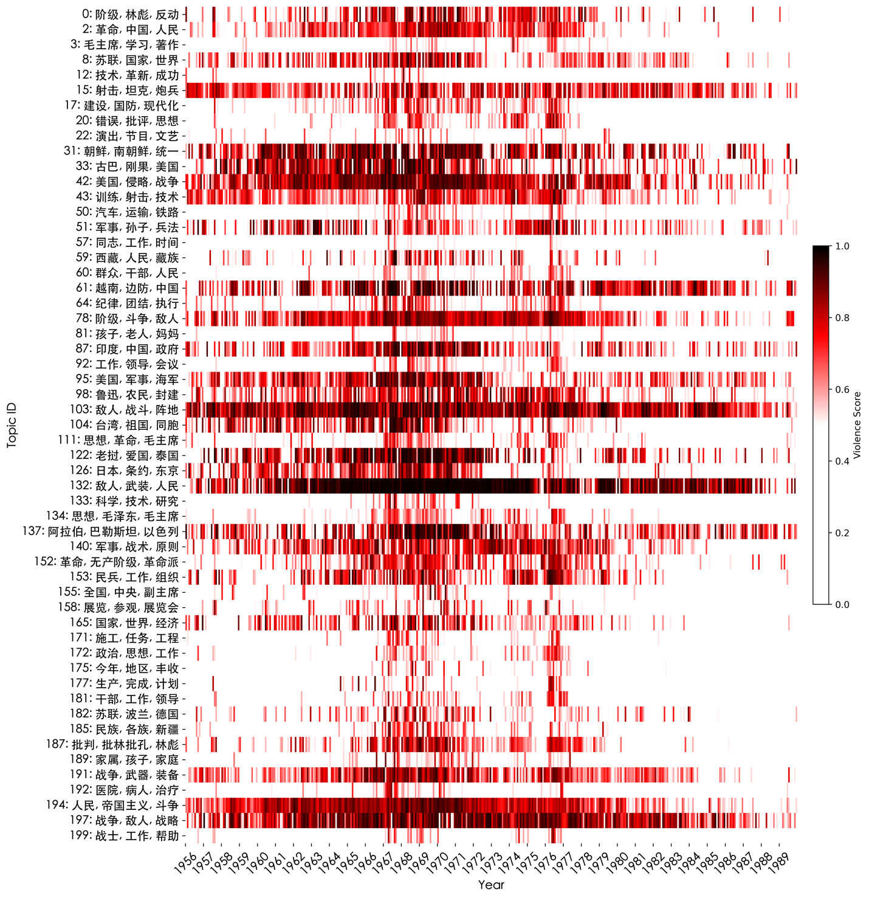
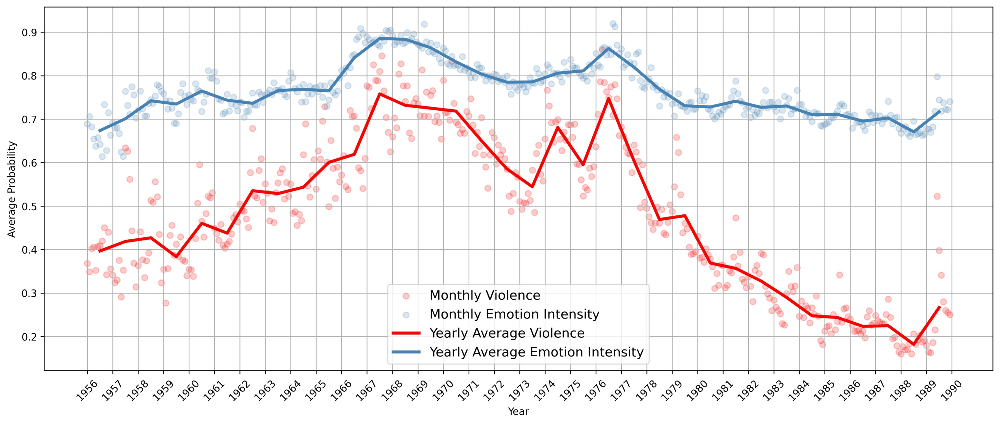

# Vectors of Violence

## Publications

### Vectors of Violence: Legitimation and Distribution of State Power in the *People's Liberation Army Daily* (*Jiefangjun Bao*), 1956-1989

From personal memoirs and cooking recipes to revolutionary agitation and war coverage, the *People's Liberation Army Daily* offers a wealth of insights into the sociopolitical and affective realities of post-1949 China. One of the few major periodicals that continued publication during the Cultural Revolution (1966-1976), the journal has received relatively scant attention from scholars, except for political science studies devoted to the PRC propaganda system. Combining close reading and historical analysis with quantitative conceptuality and text mining, we demonstrate how the *PLA Daily* legitimizes state violence differently through its representation of various soldier figures, the zhanshi, the junren, and the minbing. Our close reading is based on the collocation analysis of these major soldier terms. We also use a large language model (a fine-tuned bert-base-chinese) to show how the journal distributes violent sentiments to international topics in times of domestic turmoil.

Our article engages with the current scholarship on military and affective violence in the PRC. Whereas sociologists and political scientists have identified all-out war mobilization as the primary means through which the Communist Party grasped power and ultimately took over China in 1949, literary scholars and art historians have focused on formal mechanisms which harnessed political energy for the dual purpose of proletarian revolution and nation making. We propose a way of bridging the two paradigms by reconsidering the mechanisms of affective distribution underlying the institutional legitimation of violence in modern China. We show how quantitative approaches to texts offer unique perspectives not only on the problem of violence and its representation in the journal, but also on the Maoist mode of writing more generally; how the distribution of violence, legitimacy, and agency can be traced, measured, and visualized; and how state-directed sentiments complemented political propaganda, enhancing the impact and reach of this important official publication.

Gilkison, Aaron, and Maciej Kurzynski, ["Vectors of Violence: Legitimation and Distribution of State Power in the People's Liberation Army Daily (Jiefangjun Bao), 1956-1989"](https://culturalanalytics.org/article/115481-vectors-of-violence-legitimation-and-distribution-of-state-power-in-the-_people-s-liberation-army-daily_-_jiefangjun-bao_-1956-1989), *Journal of Cultural Analytics* 9(1), 2024.

### Revolution + Love: Measuring the Entanglements of State Violence and Emotions in Early PRC

This paper examines the relationship between violent discourse and emotional intensity in the early revolutionary rhetoric of the People's Republic of China (PRC). Using two fine-tuned bert-base-chinese models—one for detecting violent content in texts and another for assessing their affective charge—we analyze over 185,000 articles published between 1956 and 1989 in the *People's Liberation Army Daily* ( Jiefangjun Bao ), the official journal of China's armed forces. We find a statistically significant correlation between violent discourse and emotional expression throughout the analyzed period. This strong alignment between violence and affect in official texts provides a valuable context for appreciating how other forms of writing, such as novels and poetry, can disentangle personal emotions from state power.

Kurzynski, Maciej and Aaron Gilkison, ["Revolution + Love: Measuring the Entanglements of State Violence and Emotions in Early PRC"](https://ceur-ws.org/Vol-3834/paper94.pdf), Proceedings of the *Computational Humanities Research Conference* 2024 (CHR 2024), Aarhus, Denmark. CEUR-WS, vol. 38, pp. 1012-1022.

## Resources

- [BERT-JFJB-violence-0.1](https://huggingface.co/qhchina/BERT-JFJB-violence-0.1) – *bert-base-chinese* fine-tuned on the *People's Liberation Army Daily* (*Jiefangjun Bao* or *JFJB*) for detecting violent and non-violent content in Chinese texts.
- [BERT-EmotionIntensity-0.1](https://huggingface.co/qhchina/BERT-EmotionIntensity-0.1) – *bert-base-chinese* fine-tuned on the *Douban* dataset for measuring emotional intensity in Chinese texts.